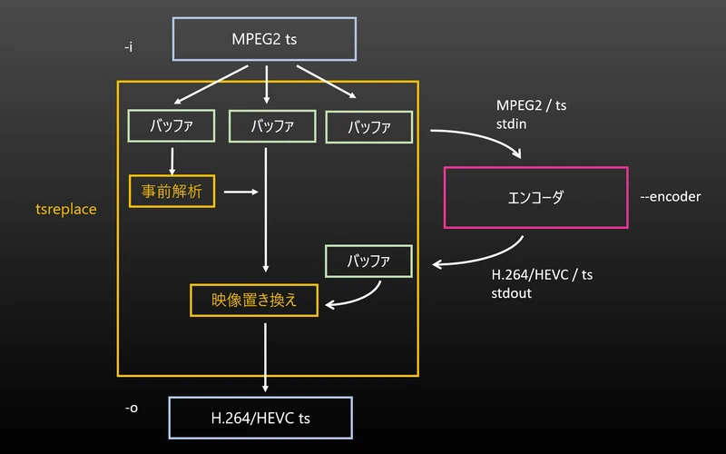

# tsreplace <!-- omit in toc -->
by rigaya

tsの映像部分のみの置き換えを行い、サイズの圧縮を図るツールです。音声含め、他のパケットはそのままコピーします。


## 目次 <!-- omit in toc -->
- [想定動作環境](#想定動作環境)
- [基本的な使用方法](#基本的な使用方法)
- [エンコードしながら置き換える](#エンコードしながら置き換える)
- [具体的な使用例](#具体的な使用例)
- [使用例 (インタレ保持)](#使用例-インタレ保持)
- [オプション](#オプション)
- [制限事項](#制限事項)
- [ソースコードについて](#ソースコードについて)
- [謝辞](#謝辞)
- [ソースの構成](#ソースの構成)

## 想定動作環境
### Windows
Windows 10/11 (x86/x64)  

### Linux
Ubuntu 20.04/22.04 (x64) ほか

## 基本的な使用方法
まず、オリジナルのtsをエンコードします。出力ファイルはmp4,mkv,ts等、timstampを保持できる形式にします(raw ES不可)。のちに作る映像置き換えtsファイルのシークを円滑にするため、GOP長はデフォルトより短めのほうがよいと思います。

`QSVEncC64.exe -i <入力tsファイル> [インタレ解除等他のオプション] --gop-len 90 -o <置き換え映像ファイル>`

次にtsreplaceを使って、エンコードした映像に置き換えたtsを作成します。

`tsreplace.exe -i <入力tsファイル> -r <置き換え映像ファイル> -o <出力tsファイル>`

## エンコードしながら置き換える
下記のように、2段階に分けずエンコードしながら置き換えを行うこともできます。**この場合、Powershellを使用するとPowershell側のパイプ渡しの問題でうまく動作しないため、コマンドプロンプトをご利用ください。**

### tsreplaceでエンコーダを起動する方法

tsreplaceの```--encoder```オプションで指定のパスのエンコーダを起動し、置き換え映像を生成することができます。このとき、```-r```は指定しません。

```--encoder```後の引数は、_すべて_ エンコーダのオプションとして解釈される点に注意してください。また、エンコーダには、標準入力で受け取り、標準出力に出力するようオプションを記述する必要があります。

`tsreplace.exe -i <入力tsファイル> -o <出力tsファイル> --encoder QSVEncC64.exe -i - --input-format mpegts [インタレ解除等他のオプション] --gop-len 90 --output-format mpegts -o -`



### 置き換え映像ファイルを標準入力で受け取る方法

置き換え映像ファイルを下記のように標準入力で受け取ることもできます。

`QSVEncC64.exe -i <入力tsファイル> [インタレ解除等他のオプション] --gop-len 90 --output-format mpegts -o - | tsreplace.exe -i <入力tsファイル> -r - -o <出力tsファイル>`


## 具体的な使用例

下記では、インタレ解除してエンコードする例を示します。インタレ保持する場合は、[使用例 (インタレ保持)](#使用例-インタレ保持)を参照してください。

### ハードウェアエンコード

#### Intel QSV

QSVを使用する場合、[QSVEncC](https://github.com/rigaya/QSVEnc)を使用します。

- H.264 エンコード  
  `QSVEncC64.exe -i <入力tsファイル> --tff --vpp-deinterlace normal -c h264 --icq 23 --gop-len 90 --output-format mpegts -o - | tsreplace.exe -i <入力tsファイル> -r - -o <出力tsファイル>`

- HEVC エンコード  
  `QSVEncC64.exe -i <入力tsファイル> --tff --vpp-deinterlace normal -c hevc --icq 23 --gop-len 90 --output-format mpegts -o - | tsreplace.exe -i <入力tsファイル> -r - -o <出力tsファイル>`

#### NVENC

NVENCを使用する場合、[NVEncC](https://github.com/rigaya/NVEnc)を使用します。

- H.264 エンコード  
  `NVEncC64.exe -i <入力tsファイル> --tff --vpp-deinterlace normal -c h264 --qvbr 23 --gop-len 90 --output-format mpegts -o - | tsreplace.exe -i <入力tsファイル> -r - -o <出力tsファイル>`

- HEVC エンコード  
  `NVEncC64.exe -i <入力tsファイル> --tff --vpp-deinterlace normal -c hevc --qvbr 23 --gop-len 90 --output-format mpegts -o - | tsreplace.exe -i <入力tsファイル> -r - -o <出力tsファイル>`

### ソフトウェアエンコード

ソフトウェアエンコードを使用する場合、ffmpegを用います。

#### x264

  `ffmpeg.exe -y -i <入力tsファイル> -copyts -start_at_zero -vf yadif -an -c:v libx264 -preset slow -crf 23 -g 90 -f mpegts - | tsreplace.exe -i <入力tsファイル> -r - -o <出力tsファイル>`

#### x265

  `ffmpeg.exe -y -i <入力tsファイル> -copyts -start_at_zero -vf yadif -an -c:v libx265 -preset medium -crf 23 -g 90 -f mpegts - | tsreplace.exe -i <入力tsファイル> -r - -o <出力tsファイル>`

## 使用例 (インタレ保持)

インタレ保持の場合はH.264を使用します。HEVCはサポートしません。

### ハードウェアエンコード

ハードウェアエンコードの場合、インタレ保持に対応したハードウェアが必要です。

#### Intel QSV

  インタレ保持にはPGモードの使用可能なGPUが必要です。(Arc GPUでは使用できません)

  `QSVEncC64.exe -i <入力tsファイル> --tff -c h264 --icq 23 --gop-len 90 --output-format mpegts -o - | tsreplace.exe -i <入力tsファイル> -r - -o <出力tsファイル>`
  
#### NVENC

  インタレ保持にはGTX1xxx以前のGPUが必要です。

  `NVEncC64.exe -i <入力tsファイル> --tff -c h264 --qvbr 23 --gop-len 90 --output-format mpegts -o - | tsreplace.exe -i <入力tsファイル> -r - -o <出力tsファイル>`  

### ソフトウェアエンコード

  `ffmpeg.exe -y -i <入力tsファイル> -copyts -start_at_zero -an -c:v libx264 -flags +ildct+ilme -preset slow -crf 23 -g 90 -f mpegts - | tsreplace.exe -i <入力tsファイル> -r - -o <出力tsファイル>`


## オプション

### -o, --output &lt;string&gt;
出力tsファイルのファイルパス。"-"で標準出力になります。

### -i, --input &lt;string&gt;
入力tsファイルのファイルパス。"-"で標準入力になります。

### -r, --replace &lt;string&gt;
置き換える映像の入っているファイルのパス。"-"で標準入力になります。

timestampを保持できるコンテナ入りの映像を想定しており、raw ES等は考慮しません。また、```--encoder```との併用はできません。

### --encoder &lt;string&gt; [&lt;string&gt;]...
```-r```を指定する代わりに、指定のエンコーダを起動してエンコーダを行います。```-r```との併用はできません。

```--encoder```後は、エンコーダのパスとその引数として扱います。具体的な指定方法は、使用例を確認してください。

### --start-point &lt;string&gt;
置き換え時の時刻の起点を指定します。

- **パラメータ**
  - keyframe (デフォルト)  
    最初のキーフレームの時刻を起点とします。tsファイルを[QSVEncC](https://github.com/rigaya/QSVEnc)/[NVEncC](https://github.com/rigaya/NVEnc)/[VCEEncC](https://github.com/rigaya/VCEEnc)/[rkmppenc](https://github.com/rigaya/rkmppenc)でエンコードした場合やffmpegでエンコードした場合に映像のみ処理した場合に使用します。

  - firstframe  
    最初のフレームの時刻を起点とします。tsファイルをlwinput.auiで読み込みエンコードした場合に使用します。

  - firstpacket  
    映像・音声の最初のパケットの時刻を起点とします。

### --replace-format &lt;string&gt;
置き換える映像の入っているファイルのフォーマットを指定します。

### --add-aud
映像パケットごとにAUDを自動挿入します。(デフォルト：オン)

### --no-add-aud
映像パケットごとのAUDの自動挿入を無効にします。

### --add-headers
映像のキーフレームごとにヘッダを自動挿入します。(デフォルト：オン)

### --no-add-headers
映像のキーフレームごとのヘッダの自動挿入を無効にします。

## 制限事項

下記については、対応予定はありません。

- カット編集等の行われたtsおよび映像ファイルは、置き換え時の同期が困難なため非対応です。
- 音声・字幕等、映像以外に関わる処理
- 入力tsファイルの制限
  - 188byte tsのみ対応しています。
  - 解像度変更のあるtsについては動作は検証しません。
- 置き換え映像ファイルの制限
  - H.264/HEVCの置き換えのみ対応します。
  - インタレ保持はH.264のみ対応します。
  - 置き換えファイルはtimestampを保持できるコンテナ入りの映像を想定しています。
    ESでの動作は検証しません。

## ソースコードについて
- MITライセンスです。
- 本ソフトウェアでは、
  [ffmpeg](https://ffmpeg.org/)
  を使用しています。

## 謝辞
本ソフトウェア作成に当たり、
[tsreadex](https://github.com/xtne6f/tsreadex)を大変参考にさせていただきました。  
どうもありがとうございました。


## ソースの構成
Windows ... VCビルド  

文字コード: UTF-8-BOM  
改行: CRLF  
インデント: 空白x4  
