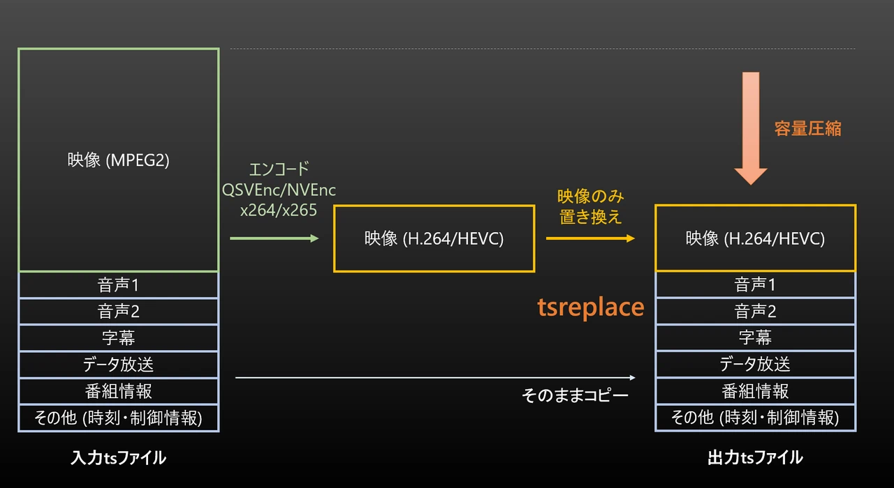
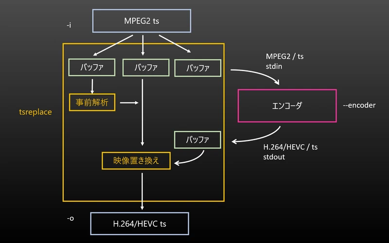

# tsreplace <!-- omit in toc -->
by rigaya

tsの映像部分のみの置き換えを行い、サイズの圧縮を図るツールです。音声含め、他のパケットはそのままコピーします。



## 目次 <!-- omit in toc -->
- [想定動作環境](#想定動作環境)
- [基本的な使用方法](#基本的な使用方法)
- [エンコードしながら置き換える](#エンコードしながら置き換える)
- [追加オプション](#追加オプション)
- [具体的な使用例](#具体的な使用例)
- [具体的な使用例 (インタレ保持)](#具体的な使用例-インタレ保持)
- [途中区間カット](#途中区間カット)
- [全オプション一覧](#全オプション一覧)
- [制限事項](#制限事項)
- [ソースコードについて](#ソースコードについて)
- [謝辞](#謝辞)
- [ソースの構成](#ソースの構成)

## 想定動作環境
### Windows
Windows 10/11 (x86/x64)  

### Linux
Ubuntu 20.04 - 24.04 (x64/arm64) ほか

---

## 基本的な使用方法

tsreplaceを使用するには、コマンドラインから直接使用する方法と、[Amatsukaze(GUI)](https://github.com/rigaya/Amatsukaze)から使用する方法が存在します。ここでは、コマンドラインから直接使用する方法を記載します。

まず、オリジナルのtsをエンコードします。出力ファイルはmp4,mkv,ts等、timstampを保持できる形式にします(raw ES不可)。のちに作る映像置き換えtsファイルのシークを円滑にするため、GOP長はデフォルトより短めのほうがよいと思います。

`QSVEncC64.exe -i <入力tsファイル> [インタレ解除等他のオプション] --gop-len 90 -o <置き換え映像ファイル>`

次にtsreplaceを使って、エンコードした映像に置き換えたtsを作成します。

`tsreplace.exe -i <入力tsファイル> -r <置き換え映像ファイル> -o <出力tsファイル>`

## エンコードしながら置き換える
下記のように、2段階に分けずエンコードしながら置き換えを行うこともできます。

### tsreplaceでエンコーダを起動する方法

tsreplaceの```-e```オプションで指定のパスのエンコーダを起動し、置き換え映像を生成することができます。このとき、```-r```は指定しません。

```-e```後の引数は、_すべて_ エンコーダのオプションとして解釈される点に注意してください。また、エンコーダには、標準入力で受け取り、標準出力に出力するようオプションを記述する必要があります。

`tsreplace.exe -i <入力tsファイル> -o <出力tsファイル> -e QSVEncC64.exe -i - --input-format mpegts [インタレ解除等他のオプション] --gop-len 90 --output-format mpegts -o -`



### 置き換え映像ファイルを標準入力で受け取る方法

置き換え映像ファイルを下記のように標準入力で受け取ることもできます。**この場合、Powershellを使用するとPowershell側のパイプ渡しの問題でうまく動作しないため、コマンドプロンプトをご利用ください。**

`QSVEncC64.exe -i <入力tsファイル> [インタレ解除等他のオプション] --gop-len 90 --output-format mpegts -o - | tsreplace.exe -i <入力tsファイル> -r - -o <出力tsファイル>`

---

## 追加オプション

- 置き換えるサービスを指定する

  全サービスを録画しているtsファイルを対象にする場合、```--service``` で処理するサービスを指定することができます。

- データ放送を削除してさらに圧縮する

  データ放送のパケットも含まれるtsファイルを対象にする場合、データサイズに占める割合が比較的大きいことがあります。データ放送が不要な場合には```--remove-typed```オプションを追加すると、データ放送のパケットを削除することができます。

---

## 具体的な使用例

下記では、インタレ解除してエンコードする例を示します。インタレ保持する場合は、[具体的な使用例 (インタレ保持)](#具体的な使用例-インタレ保持)を参照してください。

### ハードウェアエンコード

- Intel QSV

  QSVを使用する場合、[QSVEncC](https://github.com/rigaya/QSVEnc)を使用します。

  - H.264 エンコード  
    `tsreplace.exe -i <入力tsファイル> -o <出力tsファイル> -e QSVEncC64.exe -i - --input-format mpegts --tff --vpp-deinterlace normal -c h264 --icq 23 --gop-len 90 --output-format mpegts -o -`

  - HEVC エンコード  
    `tsreplace.exe -i <入力tsファイル> -o <出力tsファイル> -e QSVEncC64.exe -i - --input-format mpegts --tff --vpp-deinterlace normal -c hevc --icq 23 --gop-len 90 --output-format mpegts -o -`

- NVENC

  NVENCを使用する場合、[NVEncC](https://github.com/rigaya/NVEnc)を使用します。

  - H.264 エンコード  
    `tsreplace.exe -i <入力tsファイル> -o <出力tsファイル> -e NVEncC64.exe -i - --input-format mpegts --tff --vpp-deinterlace normal -c h264 --qvbr 23 --gop-len 90 --output-format mpegts -o -`

  - HEVC エンコード  
    `tsreplace.exe -i <入力tsファイル> -o <出力tsファイル> -e NVEncC64.exe -i - --input-format mpegts --tff --vpp-deinterlace normal -c hevc --qvbr 23 --gop-len 90 --output-format mpegts -o -`

### ソフトウェアエンコード

ソフトウェアエンコードを使用する場合、ffmpegを用います。

- x264

  `tsreplace.exe -i <入力tsファイル> -o <出力tsファイル> -e ffmpeg.exe -y -f mpegts -i - -copyts -start_at_zero -vf yadif -an -c:v libx264 -preset slow -crf 23 -g 90 -f mpegts -`

- x265

  `tsreplace.exe -i <入力tsファイル> -o <出力tsファイル> -e ffmpeg.exe -y -f mpegts -i - -copyts -start_at_zero -vf yadif -an -c:v libx265 -preset medium -crf 23 -g 90 -f mpegts -`

## 具体的な使用例 (インタレ保持)

インタレ保持の場合はH.264を使用します。HEVCはサポートしません。

### ハードウェアエンコード

ハードウェアエンコードの場合、インタレ保持に対応したハードウェアが必要です。

- Intel QSV

  インタレ保持にはPGモードの使用可能なGPUが必要です。(Arc GPUでは使用できません)

  `tsreplace.exe -i <入力tsファイル> -o <出力tsファイル> -e QSVEncC64.exe -i - --input-format mpegts --tff -c h264 --icq 23 --gop-len 90 --output-format mpegts -o -`
  
- NVENC

  インタレ保持にはGTX1xxx以前のGPUが必要です。

  `tsreplace.exe -i <入力tsファイル> -o <出力tsファイル> -e NVEncC64.exe -i - --input-format mpegts --tff -c h264 --qvbr 23 --gop-len 90 --output-format mpegts -o -`

### ソフトウェアエンコード

- x264  

  `tsreplace.exe -i <入力tsファイル> -o <出力tsファイル> -e ffmpeg.exe -y -f mpegts -i - -copyts -start_at_zero -an -c:v libx264 -flags +ildct+ilme -preset slow -crf 23 -g 90 -f mpegts -`

- x262

  `ffmpeg.exe -i input.ts -map 0:v:0 -an -sn -dn -pix_fmt yuv420p -f yuv4mpegpipe - | x262.exe --demuxer y4m --fps 30000/1001 --tff --profile main --level high --keyint 15 --vbv-maxrate 20000 --vbv-bufsize 9782 -o - - | ffmpeg.exe -f mpegvideo -r 30000/1001 -i - -c:v copy -f mpegts <置き換え映像ファイル>.ts`
  `tsreplace.exe -i <入力tsファイル> -r <置き換え映像ファイル>.ts -o <出力tsファイル>`

---

## 途中区間カット

```--cut-list```オプションでカットリストを指定すると、映像の置き換えと同時に途中区間カットを行うことができます。

カット区間では映像だけでなく、音声・字幕・文字スーパーのパケットも削除され、PTS/DTS/PCRはカットした時間分だけ詰められて連続した時間軸に再マップされます。音声は再エンコードせず、ADTSフレーム境界にそろえてカットします (このため結合部ごとに最大1 ADTSフレーム未満 (約21ms) の音声長の誤差が生じます)。

このとき置き換え映像には、**カット後のフレームのみを含む映像**を指定します。[Amatsukaze](https://github.com/rigaya/Amatsukaze)から使用する場合、カットリストの生成と各オプションの指定は自動で行われます。

`tsreplace.exe -i <入力tsファイル> -r <カット済み置き換え映像> -o <出力tsファイル> --cut-list <カットリスト>`

### カットリストの形式

UTF-8のテキストファイルです (BOM付きも可)。

```text
# tsreplace-cut-v2
timebase=90000

cut -1 6970000000
cut 6975723365 6981125762
cut 7038453032 7055555117
cut 7060000000 -1
```

- 1行目は識別行 ```# tsreplace-cut-v2``` である必要があります。
- ```timebase=90000``` の指定が必須です (90000のみ対応)。
- ```cut <start> <end>``` で削除区間を指定します。
  - 値は元TS上の絶対PTS (90kHz単位、33bit) です。startは区間に含まれ、endは含まれません。
  - ```start > end``` の場合は、33bit wrapを跨ぐ区間として扱われます。
- ```-1``` は先頭・末尾のカット(トリム)を表します。
  - ```cut -1 <pts>``` … **先頭トリム**。```<pts>``` から出力を開始します。この位置が置き換え映像の先頭フレームに対応する元TS上のPTSとなります。最初の ```cut``` 行にのみ指定できます。
  - ```cut <pts> -1``` … **末尾トリム**。```<pts>``` で出力を終了します。最後の ```cut``` 行にのみ指定できます。
  - 先頭・末尾トリムは中間の途中区間カットと異なり、タイムスタンプの詰め直しは行いません (出力の開始点・終了点を決めるだけです)。
- 空行と ```#``` で始まる行は無視されます。

### 制約

- ```--preserve-other-services``` とは併用できません (エラーになります)。出力には処理対象のサービスのみが残ります。
- ```--cut-list``` 指定時は ```--remove-typed``` が強制的に有効になり、データ放送のパケットは削除されます (```--no-remove-typed``` は無視されます)。
- 先頭トリム (```cut -1 <pts>```) は ```--replace-delay``` と併用できません (エラーになります)。また、先頭トリムが起点を直接与えるため ```--start-point``` は無視されます。
- 末尾トリム (```cut <pts> -1```) は ```--end-at-replace-eof``` と併用できません (エラーになります)。
- EIT/TOT等のSIパケットの内容 (放送時刻等) は書き換えません。

---

## 全オプション一覧

### -o, --output &lt;string&gt;
出力tsファイルのファイルパス。"-"で標準出力になります。

### -i, --input &lt;string&gt;
入力tsファイルのファイルパス。"-"で標準入力になります。

### -r, --replace &lt;string&gt;
置き換える映像の入っているファイルのパス。"-"で標準入力になります。

timestampを保持できるコンテナ入りの映像を想定しており、raw ES等は考慮しません。また、```-e```, ```--encoder```との併用はできません。

### -e, --encoder &lt;string&gt; [&lt;string&gt;]...
```-r```を指定する代わりに、指定のエンコーダを起動してエンコーダを行います。```-r```との併用はできません。

```-e```, ```--encoder```後は、エンコーダのパスとその引数として扱います。具体的な指定方法は、使用例を確認してください。

### -s, --service &lt;int&gt; or &lt;string&gt;
処理対象のサービスを指定します。

- &lt;int&gt; の場合  
  処理対象のサービスIDを直接指定します。

- &lt;string&gt; の場合  
  ```1st, 2nd, 3rd, ....``` で、処理対象のサービスをサービスの並び順に従って指定します。

### --preserve-other-services
処理対象でないサービスのパケットも保存します。(デフォルト：オフ)

### --copy-filets
入力ファイルのタイムスタンプを出力ファイルにコピーします。(デフォルト：オフ)

### --start-point &lt;string&gt;
置き換え時の時刻の起点を指定します。

- **パラメータ**
  - keyframe (デフォルト)  
    最初のキーフレームの時刻を起点とします。tsファイルを[QSVEncC](https://github.com/rigaya/QSVEnc)/[NVEncC](https://github.com/rigaya/NVEnc)/[VCEEncC](https://github.com/rigaya/VCEEnc)/[rkmppenc](https://github.com/rigaya/rkmppenc)でエンコードした場合やffmpegでエンコードした場合に映像のみ処理した場合に使用します。

  - firstframe  
    最初のフレームの時刻を起点とします。tsファイルをlwinput.auiで読み込みエンコードした場合に使用します。

  - firstpacket  
    映像・音声の最初のパケットの時刻を起点とします。

カットリストで先頭トリム (```cut -1 <pts>```) を指定した場合、起点はカットリストが直接与えるため、このオプションは無視されます。

### --replace-delay &lt;int&gt;
置き換える映像の、オリジナルとの遅れを90kHz単位で指定します。

遅らせた時刻の分だけ、元のtsのパケット(映像・音声・その他含む)を出力せずにカットし、置き換え対象とのずれを修正します。

`--start-point` は置き換え映像の時刻合わせの基準であり、`--replace-delay` とは独立して動作します。

```--cut-list``` を使用する場合は、代わりにカットリストの先頭トリム (```cut -1 <pts>```) を使用してください (併用不可)。

### --end-at-replace-eof [&lt;int&gt;]
置き換える映像ファイルのEOFに到達した時点から、指定した余裕時間(ms)後にTS出力を終了します。

- 引数省略時  
  100ms後に出力を終了します。

- &lt;int&gt; を指定した場合  
  指定した値をms単位の余裕時間として使用します。例: `--end-at-replace-eof 200` でEOF+200ms時点で出力終了。

```--cut-list``` を使用する場合は、代わりにカットリストの末尾トリム (```cut <pts> -1```) を使用してください (併用不可)。末尾トリムなら元TS上の絶対PTSで終了位置を直接指定できます。

### --cut-list &lt;string&gt;
途中区間カットのカットリストファイルのパスを指定します。カットリストの形式と制約は[途中区間カット](#途中区間カット)を参照してください。

指定した場合、映像の置き換えと同時に、カット区間の音声・字幕等の削除とタイムスタンプの再マップを行います。```--preserve-other-services```とは併用できず、```--remove-typed```が強制的に有効になります。

先頭・末尾のカット(トリム)もカットリスト内で指定するため、```--replace-delay``` / ```--end-at-replace-eof``` は不要です。

### --replace-format &lt;string&gt;
置き換える映像の入っているファイルのフォーマットを指定します。

### --add-aud
映像パケットごとにAUDを自動挿入します。(デフォルト：オン)

### --no-add-aud
映像パケットごとのAUDの自動挿入を無効にします。

### --add-headers
映像のキーフレームごとにヘッダを自動挿入します。(デフォルト：オン)

### --no-add-headers
映像のキーフレームごとのヘッダの自動挿入を無効にします。

### --remove-typed
データ放送のパケットを削除し、さらなる圧縮を図ります。(デフォルト：オフ)

具体的には、データ放送で使用されているISO/IEC 13818-6 type DのPIDストリームのパケットを削除します。

### --log &lt;string&gt;
ログを指定のファイルに出力します。

### --log-level &lt;string&gt;
ログ出力のレベルを下記から選択します。

```
- debug, info(default), warn, error
```

---

## 制限事項

下記については、対応予定はありません。

- カット編集等の行われた入力tsは、置き換え時の同期が困難なため非対応です。カット済みの置き換え映像は、```--cut-list```による途中区間カット([途中区間カット](#途中区間カット)参照)と組み合わせた場合のみ対応します。
- 音声・字幕等、映像以外に関わる処理 (途中区間カット時のカット区間の削除・タイムスタンプ補正を除く)
- 入力tsファイルの制限
  - 188byte tsのみ対応しています。
  - 解像度変更のあるtsについては動作は検証しません。
- 置き換え映像ファイルの制限
  - MPEG-2/H.264/HEVCの置き換えに対応します。
  - インタレ保持はMPEG-2/H.264のみ対応します。
  - 置き換えファイルはtimestampを保持できるコンテナ入りの映像を想定しています。
    ESでの動作は検証しません。

## ソースコードについて
- MITライセンスです。
- 本ソフトウェアでは、
  [ffmpeg](https://ffmpeg.org/)
  を使用しています。

## 謝辞
本ソフトウェア作成に当たり、
[tsreadex](https://github.com/xtne6f/tsreadex)を大変参考にさせていただきました。  
どうもありがとうございました。


## ソースの構成
Windows ... VCビルド  

文字コード: UTF-8-BOM  
改行: CRLF  
インデント: 空白x4  
